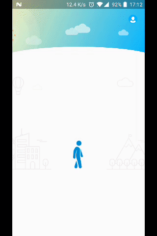
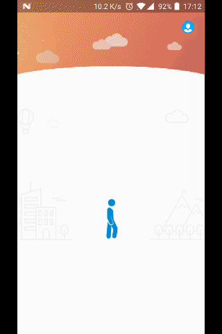
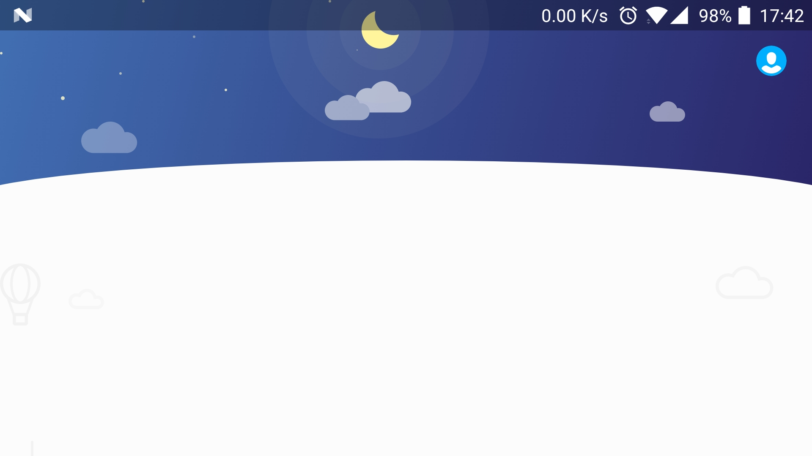

# ToolbarDelight
Android UI about custom toolbar

### Effect:

### 说明
之前曾有幸读到博文[Toolbar Delight](https://androiduipatterns.com/toolbar-delight-8c5e4500b899)，效果非常赞，实现方式博主也说明的非常清楚，遗憾的是并没有源码，故在闲暇时光写了本Demo.

